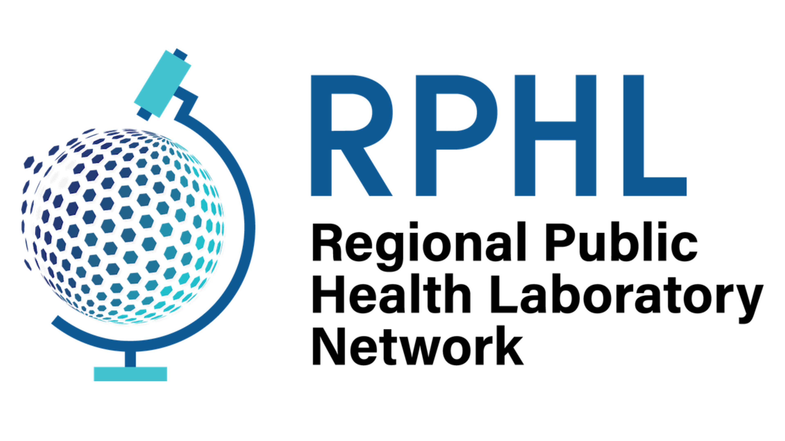
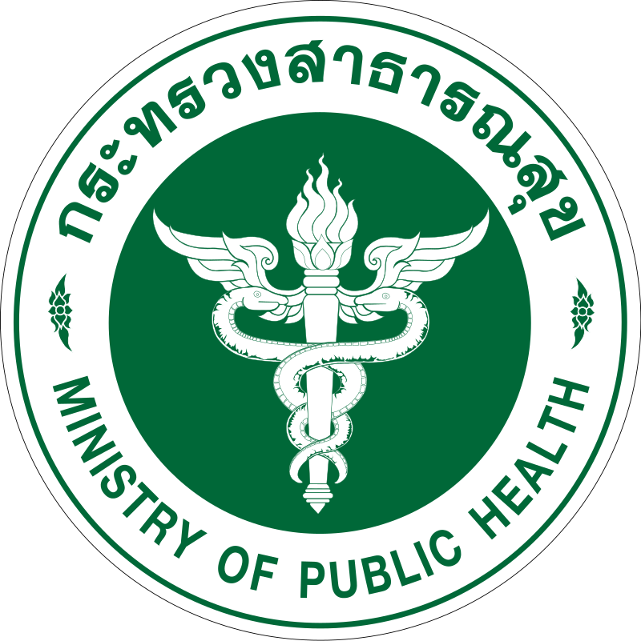
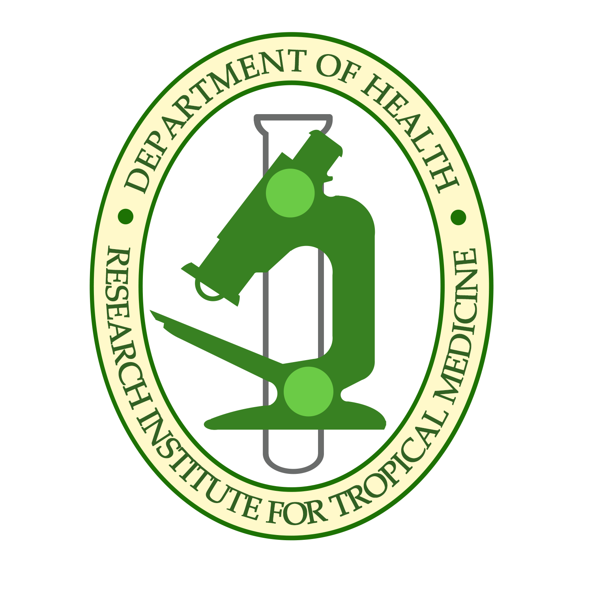

# 🦠 Pathogen Genomics Bioinformatics Training 🦠

Welcome to your origin story as a bioinformatician!

This training will guide you from:

> “What is this terminal thing?”

to

> “Ah yes, this phylogenetic tree tells a story.”

---

This repository will contain:

* hands-on exercises  
* real-world datasets  
* step-by-step workflows  
* genomic epidemiology interpretation
  
---

## 🧬 What to expect

| Module | Topic | Skills |
|--------|------|-------|
| 01 | Linux Command Line | file navigation, text processing |
| 02 | NGS Data QC | nanopore QC, trimming |
| 03 | Bioinformatics Workflows | metagenomics, alignment, consensus |
| 04 | Downstream Analysis | phylogenetics, clade interpretation |

---

## 🧠 Why this matters

Pathogen genomics helps us:

* track outbreaks  
* understand transmission  
* detect emerging variants  
* support public health decisions  

---

> “We are basically detectives… but for genomes.”


## 📁 Repository Structure (Coming Soon)

The training materials will be organized as follows:
```
pathogen-genomics-training/
│
├── module-01-linux/
├── module-02-ngs-qc/
├── module-03-workflows/
└── module-04-downstream-analysis/
```

Each module will contain:
* step-by-step guides
* exercises
* datasets (or download links)
* expected outputs


> 🚧 This repository is currently under development. Stay tuned 👀!

---

## Software Requirements

Good news: you will be provided with a **training virtual machine (VM)** where you will do all the analyses.

Bad news: the command line still requires typing.

Participants only need tools to **connect**, **analyze**, and **download results**.


### 1️⃣ Terminal or SSH client

Used to connect to the training VM.

Participants must have access to **one** of the following:

| Operating System | Recommended Tool |
|------------------|------------------|
| 🐧 Linux | Terminal |
| 🍎 Mac | Terminal |
| 🪟 Windows | WSL, Command Prompt or PowerShell |

---

### 2️⃣ Web browser 🌐

Used for:

* Nextclade/Nextstrain
* Pavian visualization
* Database access
* occasional panic-Googling
* ask AI for help 🤭

Recommended browsers:

* Google Chrome
* Brave
* Firefox

---

### 3️⃣ File transfer software

Used to download results from the VM to your laptop.

| Operating System | Recommended Tool |
|------------------|------------------|
| 🪟 Windows | [WinSCP](https://winscp.net/eng/download.php) |
| 🍎 Mac | [Cyberduck](https://cyberduck.io/download/) or [FileZilla](https://filezilla-project.org/) |
| 🐧 Linux | [FileZilla](https://filezilla-project.org/) |

---

### ✔ Minimum Checklist

Participants should have:

* laptop 💻 (any laptop capable of running the tools listed below; no special specifications required)
* terminal or SSH client 🔐
* web browser 🌐
* file transfer software 📂
* curiosity 🧠
* patience 🥲
  
---

## 🧠 Expected Background

This training is designed for participants **with basic knowledge of bioinformatics but limited practical experience**

No prior coding experience is required.

---

### Biology knowledge 🧬

Participants should be familiar with:

* DNA and genes 
* basic concept of pathogens
* general idea of sequencing

If you know that:

DNA ≠ WiFi password

you are ready.

---

### Computer skills 💻

Participants should be comfortable with:

* using a computer
* copying and pasting commands
* navigating folders
* downloading files
* not renaming files to `final_final_v3_reallyfinal.fastq`

---

### Helpful but NOT required

* prior exposure to FASTA or FASTQ files
* familiarity with genomics
* basic command line experience
* emotional attachment to Linux terminals

We will guide you through everything step-by-step.

---

## 🧘 Mindset requirements

* accept that typos happen
* accept that errors happen
* accept that debugging is part of the journey
* accept that the pipeline sometimes works only when observed

---

## ⚠ Mandatory requirement

Must be a memer.

Example acceptable responses to errors:

> "Have you tried turning it off and on again?"

> "It worked yesterday."

> "Who wrote this script?"

> "Oh... I forgot to activate the environment."

> "Why is there a space in the filename?"

> "Permission denied... but I feel permitted."

---

## 🧪 Bioinformatics truths

* every folder contains another folder
* every tool requires another dependency
* every dataset has one weird sample
* every command works after the third try
* every pipeline produces at least one plot nobody understands at first

---

## ☕ survival tips

* copy-paste is encouraged
* reading error messages is a life skill
* Google is part of the workflow
* breaks improve reproducibility
* hydration improves debugging accuracy

---

## inspirational quote

> "In theory, theory and practice are the same.  
> In practice, they are not." – every bioinformatician ever
---

You are ready 🚀

---

# 📚 Advanced Readings & Resources

For those who want to go deeper (or accidentally became the “bioinformatics person” in the lab 👀)

> "Half of bioinformatics is knowing what to Google.  
> The other half is knowing which result is correct."

---

* https://linuxcommand.org/lc3_learning_the_shell.php  
* https://explainshell.com/ (type a command → see what each part does 🔥)
* https://docs.conda.io/en/latest/
* https://docs.nextstrain.org/
  

## 🔹 Bonus: Learn by Breaking Things™

* https://stackoverflow.com/  
* https://chat.openai.com/ 😄  

---

## 💡 Suggested Topics to Explore

If you're feeling curious (or brave):

* bash scripting (`for` loops, variables)
* environment management
* workflow automation

---

### 📄 Some Useful Papers and tool links

* Realingo AML, Polotan FGM, Abulencia MFP, et al. Integration of bioinformatic tools for the detection of SARS-CoV-2 co-infection cases. Microbial Genomics 2026;12(1):mgen001604. https://www.microbiologyresearch.org/content/journal/mgen/10.1099/mgen.0.001604
* Lu J, Rincon N, Wood DE, Breitwieser FP, et al. Metagenome analysis using the Kraken software suite. Nat Protoc. 2022;17:2815–2839. https://pmc.ncbi.nlm.nih.gov/articles/PMC9725748/
* Aksamentov I, Roemer C, Hodcroft EB, Neher RA. Nextclade: clade assignment, mutation calling and quality control for viral genomes. Journal of Open Source Software. 2021;6(67):3773. https://joss.theoj.org/papers/10.21105/joss.03773
* Hadfield J, Megill C, Bell SM, Huddleston J, Potter B, Callender C, et al. Nextstrain: real-time tracking of pathogen evolution. Bioinformatics. 2018;34(23):4121-4123. https://academic.oup.com/bioinformatics/article/34/23/4121/5001388


* ARTIC Network field bioinformatics pipeline - https://github.com/artic-network/fieldbioinformatics
* Kraken2 - https://github.com/DerrickWood/kraken2
* Minimap2 - https://github.com/lh3/minimap2
* Samtools - https://github.com/samtools/samtools
  


## ⚠️ Warning

Reading these may cause:

* sudden understanding of error messages
* improved debugging skills
* people asking you for help
* you saying “it depends” more often

---

## 🧠 Final Thought

> "The best bioinformaticians are not the ones who memorize commands,  
> but the ones who know how to figure things out."

<br>

You're officially beyond the slides 🚀


---

## 🌍 Partner Institutions

<p align="center">
  
  
  
  
  
  
</p>


